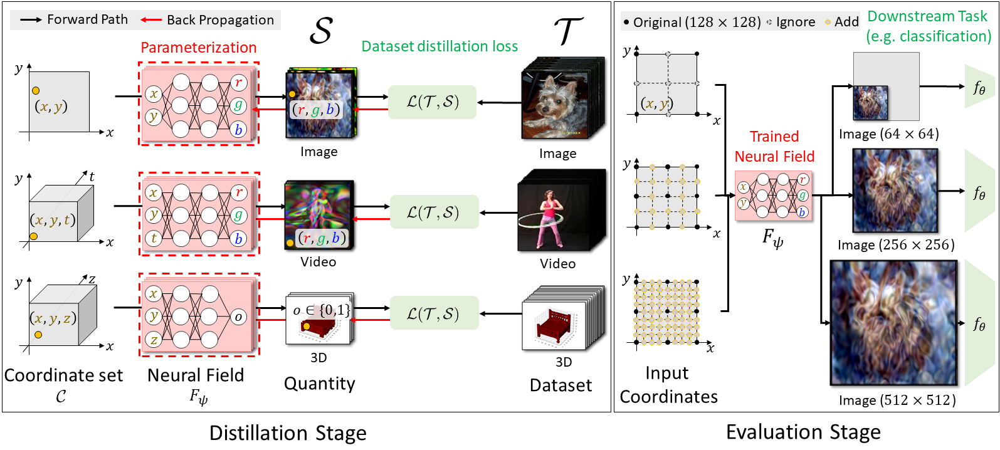

# Distilling Dataset into Neural Field (DDiF) [ICLR 2025] 

This repository contains an official PyTorch implementation for the paper [Distilling Dataset into Neural Field](https://arxiv.org/abs/2503.04835) in ICLR 2025.

**Donghyeok Shin, HeeSun Bae, Gyuwon Sim, Wanmo Kang, and Il-Chul Moon**   

## Overview

> **Abstract** *Utilizing a large-scale dataset is essential for training high-performance deep learning models, but it also comes with substantial computation and storage costs. To overcome these challenges, dataset distillation has emerged as a promising solution by compressing the large-scale dataset into a smaller synthetic dataset that retains the essential information needed for training. This paper proposes a novel parameterization framework for dataset distillation, coined Distilling Dataset into Neural Field (DDiF), which leverages the neural field to store the necessary information of the large-scale dataset. Due to the unique nature of the neural field, which takes coordinates as input and output quantity, DDiF effectively preserves the information and easily generates various shapes of data. We theoretically confirm that DDiF exhibits greater expressiveness than some previous literature when the utilized budget for a single synthetic instance is the same. Through extensive experiments, we demonstrate that DDiF achieves superior performance on several benchmark datasets, extending beyond the image domain to include video, audio, and 3D voxel.*

## Getting Started
Create a new virtual environment and install the required dependencies using the `requirements.txt` file:
```
pip install -r requirements.txt
```

## Usage
DDiF adopts [SIREN](https://arxiv.org/abs/2006.09661) as the default synthetic neural field. The main hyperparameters of DDiF are as follows: 
- `dim_in` : Input dimension (n)
- `num_layers` : Number of layers in the neural field (L)
- `layer_size` : Width of layers in the neural field (d)
- `dim_out` : Output dimension (m)
- `w0_initial` : Scaling parameter for the first layer in SIREN
- `w0` : Scaling parameter for subsequent layers in SIREN
- `lr_nf` : Learning rate for the neural field
- `epochs_init` : Epochs for warm-up training
- `lr_nf_init` : Learning rate for warm-up training

Detailed values for these hyperparameters can be found in our paper or `hyper_params.py`.
For other hyperparameters, we follow the default setting of each dataset distillation objectives.
Please refer to the provided bash scripts for detailed arguments when running experiments.

### Image domain
- Run the following command with appropriate distillation loss `DC/DM/TM`:
- For `TM`, please run `run_buffer.sh` to generate expert trajectories before distillation.
```
cd {DISTILLATION_LOSS}/scripts
bash run_DDiF.sh
```

### Video domain
- We built upon the [video distillation](https://github.com/yuz1wan/video_distillation) code.
- Please prepare [UCF101](https://www.crcv.ucf.edu/data/UCF101.php) dataset.
- Run the following command:
```
cd Video/scripts
bash run_DDiF.sh
```

### 3D Voxel domain
- Please prepare [ModelNet](https://modelnet.cs.princeton.edu/) and [ShapeNet](https://shapenet.org/) datasets.
- Run the following command:
```
cd 3D_Voxel/scripts
bash run_DDiF#{DISTILLATION_LOSS}.sh
```

## Citation
If you find the code useful for your research, please consider citing our paper.
```bib
@inproceedings{shin2025distilling,
    title={Distilling Dataset into Neural Field},
    author={Donghyeok Shin and HeeSun Bae and Gyuwon Sim and Wanmo Kang and Il-chul Moon},
    booktitle={The Thirteenth International Conference on Learning Representations},
    year={2025},
    url={https://openreview.net/forum?id=nCrJD7qPJN}
}
```
This work is heavily built upon the code from
 - *Dataset condensation with gradient matching*, [Paper](https://arxiv.org/abs/2006.05929), [Code](https://github.com/VICO-UoE/DatasetCondensation)
 - *Dataset condensation with distribution matching*, [Paper](https://arxiv.org/abs/2110.04181), [Code](https://github.com/VICO-UoE/DatasetCondensation)
 - *Dataset distillation by matching training trajectories*, [Paper](https://arxiv.org/abs/2203.11932), [Code](https://github.com/georgecazenavette/mtt-distillation)
 - *Frequency Domain-based Dataset Distillation*, [Paper](https://arxiv.org/abs/2311.08819), [Code](https://github.com/sdh0818/FreD/tree/main)
 - *Pytorch implementation of SIREN*, [Code](https://github.com/lucidrains/siren-pytorch/tree/master)
 - *Dancing with Still Images: Video Distillation via Static-Dynamic Disentanglement*, [Paper](https://arxiv.org/abs/2312.00362), [Code](https://github.com/yuz1wan/video_distillation)